# Agenda

Acessível através do caminho Atendimentos > Agenda.

O recurso agenda permite cadastrar, visualizar e interagir com os compromissos marcados:

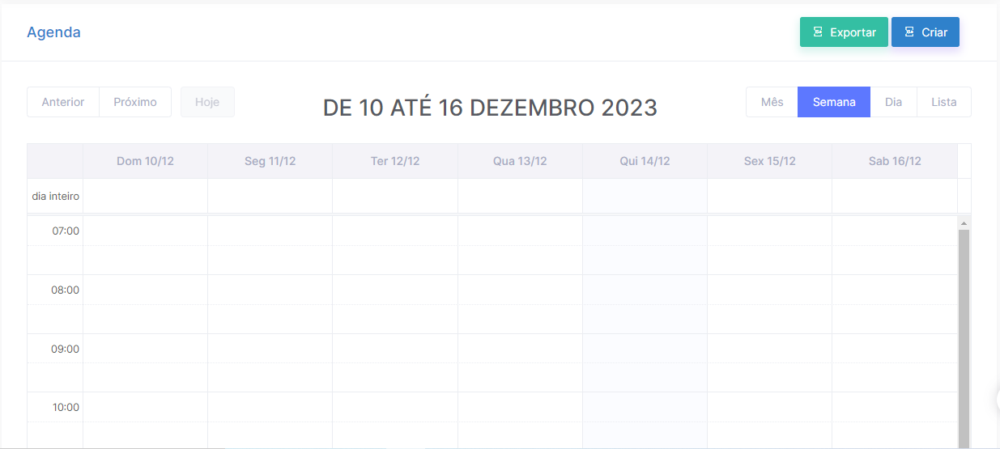

---

- **Criando um novo Agendamento!**
    
    Para criar um novo compromisso na agenda, utilize o botão Criar:
    
    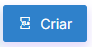
    
    Tela de criação do compromisso:
    
    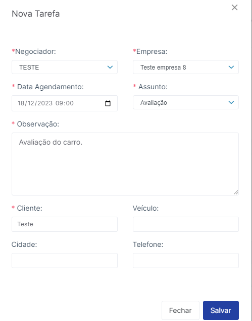
    
    - **Negociador:** Informe qual o negociador o qual terá o compromisso`(campo obrigatório)`;
    - **Empresa:** Indique qual a empresa (loja) se refere o compromisso`(campo obrigatório).`
    - **Data Agendamento:** Insira a data do compromisso bem como o horário`(campo obrigatório)`;
    - **Assunto:** Indique qual o assunto do compromisso: Avaliação, Vistoria, Pendência, Negociação, Retorno de ligação ou Visita`(campo obrigatório)`;
    - **Observação:** Digite uma observação para este compromisso`(campo obrigatório)`;
    - **Cliente:** Digite o nome do cliente a qual se refere o compromisso`(campo obrigatório)`;
    - **Veículo:** Informe o veículo em questão;
    - **Cidade:** Informe a cidade do cliente;
    - **Telefone:** Informe o telefone do cliente;
    
    Clique em Salvar para concluir.
    

---

- **Visualizando e concluindo o Agendamento:**
    
    Assim que inserido o agendamento for inserido, o mesmo ficará disponível na grade da agenda conforme data e horário inseridos:
    
    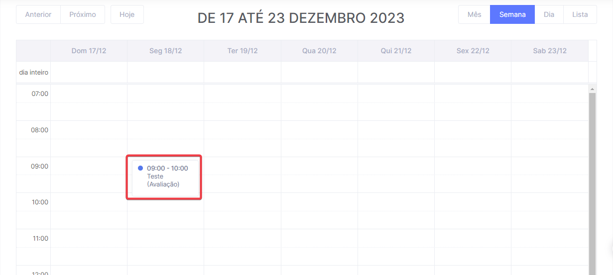
    
    Para mais detalhes sobre o agendamento, clique sobre o mesmo. A seguinte tela será apresentada, com os detalhes digitados do compromisso na etapa anterior:
    
    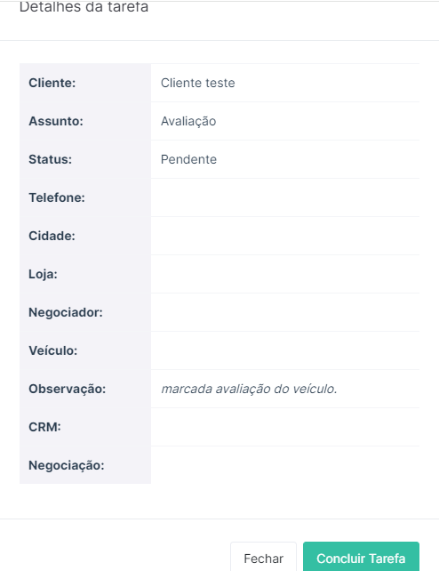
    
    Clique no botão “Concluir Agendamento” para indicar ao sistema que este compromisso foi realizado, desta forma este agendamento não será mais apresen
    

---

- **Opção Exportar a Agenda:**
    
    A Agenda possui um recurso de exportação, o qual está disponível através do botão abaixo:
    
    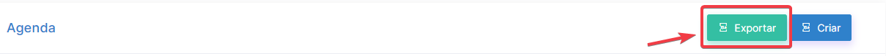
    
    O resultado da exportação será um arquivo Excel com todas as informações dos agendamentos exportados:
    
    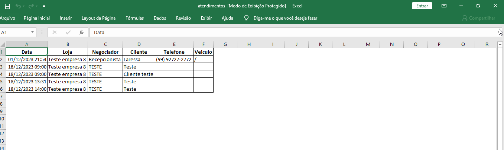
    

---

- **Opções de visualização de grade da Agenda:**
    
    A Agenda possui quatro opções de visualização, sendo elas:
    
    Mês:
    
    Visualizando por Mês, o resultado será uma grade com os dias completos do mês atual:
    
    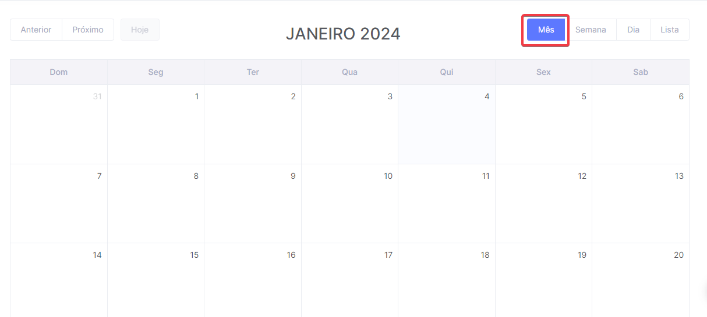
    
    Semana:
    
    Visualizando por Semana, o resultado será uma grade somente com os dias da semana atual:
    
    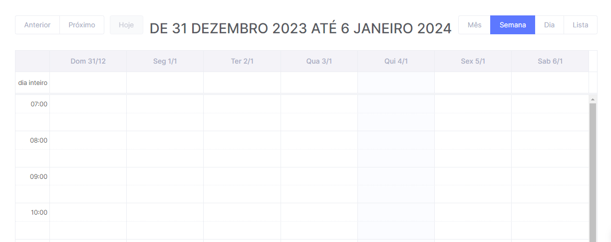
    
    Dia:
    
    Visualizando por Dia, o resultado será uma grade somente com os horários do dia de hoje:
    
    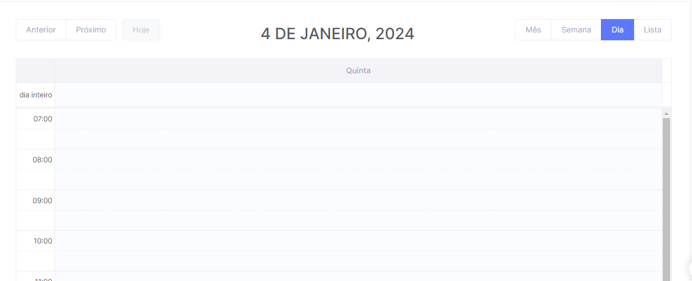
    
    Lista:
    
    Visualizando como Lista, o resultado será apenas a listagem dos compromissos dos dias:
    
    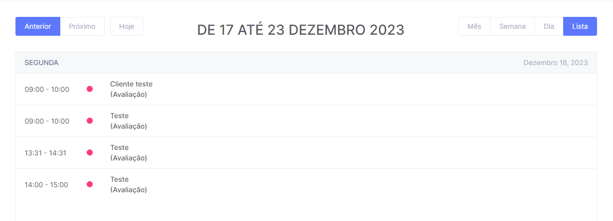
    

---